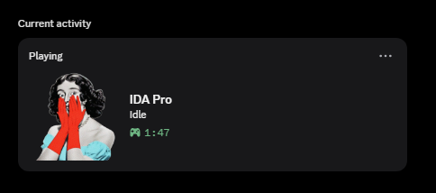
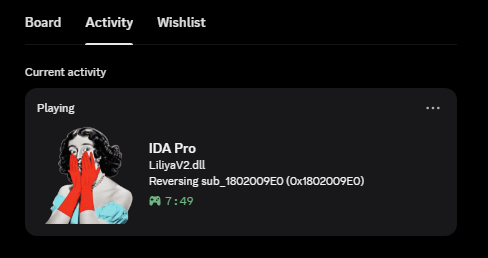
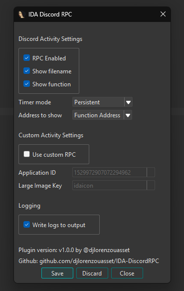

# IDA-DiscordRPC
An IDA 9.4+ plugin to show your IDA activity on Discord. Originally created by [shikataganaii](https://github.com/shikataganaii/ida-rpc-ida9), I've updated the functionality to support IDA 9.4 and added some new customization options.

## Installation
To install IDA-DiscordRPC, you have two options:
- Use the precompiled DLL in [releases](https://github.com/djlorenzouasset/IDA-DiscordRPC/releases) (save `IDA-DiscordRPC64.dll` into your IDA installation directory under the `plugins` folder), or
- Compile the source code using [Visual Studio 2026](https://visualstudio.microsoft.com/downloads/) or [CMake](https://cmake.org/download/).

### Requirements to build the project
- CMake 3.27 or newer (usually pre-installed with Visual Studio)
- A C/C++ compiler such as MSVC, GCC, or Clang
- IDA SDK (v9.4+): download it [here](https://github.com/HexRaysSA/ida-sdk/releases/latest)

### Build with Visual Studio 2026
- Download the source code with Git:
```bash
git clone https://github.com/djlorenzouasset/IDA-DiscordRPC
```
- Open `IDA-DiscordRPC.slnx` and build in Release.
- Move `IDA-DiscordRPC64.dll` into your IDA installation directory under the `plugins` folder.

### Build with CMake
- Open a Visual Studio Developer PowerShell and download the source code with Git:
```bash
git clone https://github.com/djlorenzouasset/IDA-DiscordRPC
cd IDA-DiscordRPC
```
- Set the IDA SDK path in your current environment:
```bash
$env:IDASDK = "C:\path\to\idasdk"
```
- Build the plugin:
```bash
cmake -S . -B build
cmake --build build --config Release
```
- Move `IDA-DiscordRPC64.dll` into your IDA installation directory under the `plugins` folder.

## Features
- Enable or disable the plugin at any time.
- Displays the opened filename, function name, and cursor/function address.
- Supports custom Discord RPC via custom Discord Applications (create one [here](https://discord.com/developers/applications)).
- Logs activity to a local file.

## Screenshots
Idle\
\
With a file opened\
\
Plugin settings (`CTRL+ALT+R`)\
